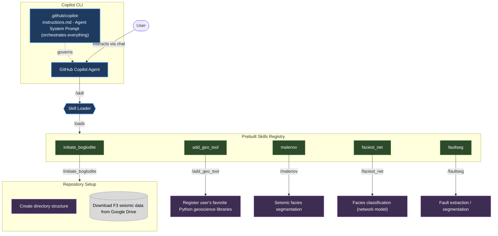

# Boglodite

Boglodite is an agent for subsurface and geoscience. There are 100+ open source repositories around geoscience and Boglodite will make it easy for geoscientists to work with these open source tools, thanks to agent 🤖 

See existing tools in the gallery below. You can also add your tool to Boglodite. 

## Work with your favorite CLI

Instruction coming soon

### Copilot CLI

### Claude Code

Support coming soon

### Opencode

Support coming soon

## Gallery

By default, Boglodite supports the following tools and workflows, each with its own `SKILL.md`.

| Name | Skill | Description |
|---|---|---|
| [MalenoV](https://github.com/bolgebrygg/MalenoV) | [SKILL.md](./skills/MalenoV/SKILL.md) | 3D CNN-based seismic facies classification on SEGY volumes using voxel inputs. |
| [facies_net](https://github.com/crild/facies_net) | [SKILL.md](./skills/facies_net/SKILL.md) | Companion to MalenoV, Modular seismic facies classification with data augmentation, TensorBoard logging, and pre-trained models. |
| [faultSeg](https://github.com/xinwucwp/faultSeg) | [SKILL.md](./skills/faultSeg/SKILL.md) | 3D U-Net for automatic seismic fault segmentation, trained on synthetic data and applied to real field volumes (Wu et al., 2019). |

  
<b>MalenoV</b>

  

