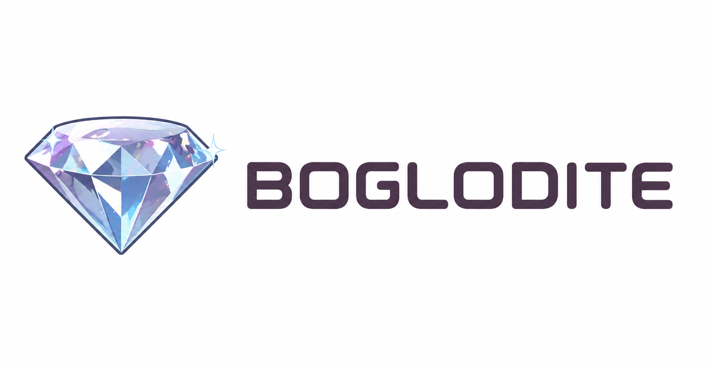
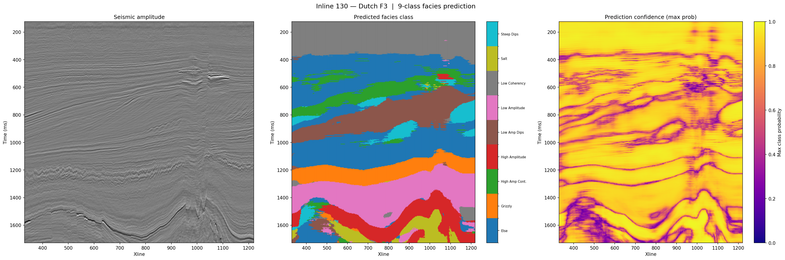
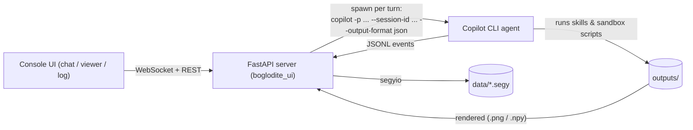
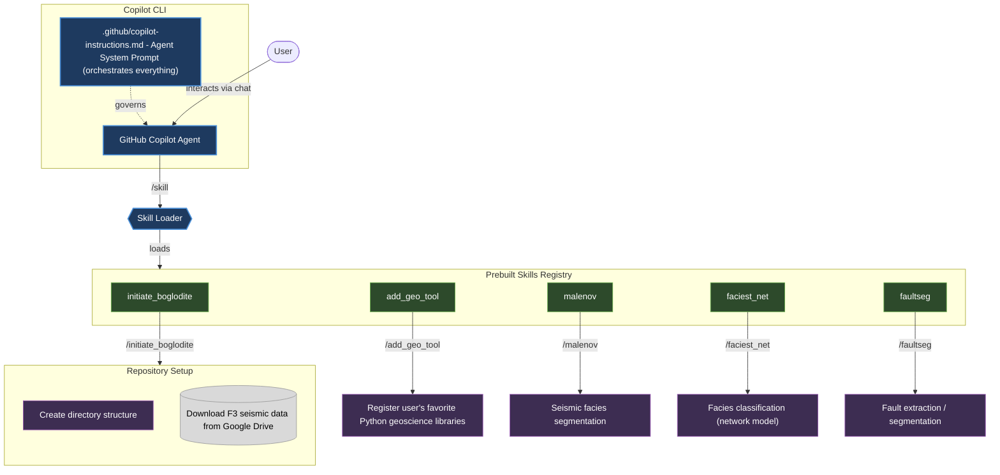

# Boglodite



Boglodite is an agent for subsurface and geoscience. There are 100+ open source repositories around geoscience and Boglodite will make it easy for geoscientists to work with these open source tools, thanks to agent 🤖 

See existing tools in the gallery below. You can also add your tool to Boglodite. 



## HITL Console

Boglodite ships with a human-in-the-loop web console that wraps the Copilot CLI agent: chat with the agent, watch it work in the live process log, browse the input seismic volume (inline / crossline / time slice), and review results from `outputs/` — all in one screen.

```bash
uv sync            # once, installs the console dependencies
uv run boglodite   # opens http://127.0.0.1:8265 in your browser
```

To expose the `boglodite` command globally (so typing `boglodite` anywhere in the repo works without `uv run`):

```bash
uv tool install --editable .
```

The console keeps the existing Copilot CLI architecture untouched — each chat turn is one non-interactive run:

```
copilot -p "<prompt>" --session-id <uuid> --allow-all-tools --output-format json --no-ask-user
```

A fixed `--session-id` gives multi-turn memory across the whole conversation; `--output-format json` streams tool calls and messages into the chat and log panels; `.github/copilot-instructions.md`, `skills/`, and the BYOK env vars from `set-copilot-env.sh` (`COPILOT_PROVIDER_BASE_URL`, `COPILOT_MODEL` for LM Studio) all apply unchanged. If a BYOK provider is configured, the model picker in the top bar lists the models it serves (`/v1/models`) and passes your choice via `--model`; the skills picker injects selected `skills/*/SKILL.md` paths into the prompt.


```mermaid
flowchart LR
    Browser["Console UI (chat / viewer / log)"] -- WebSocket + REST --> Server["FastAPI server (boglodite_ui)"]
    Server -- "spawn per turn:<br/>copilot -p ... --session-id ... --output-format json" --> Copilot["Copilot CLI agent"]
    Copilot -- "JSONL events" --> Server
    Server -- segyio --> SEGY[("data/*.segy")]
    Copilot -- "runs skills & sandbox scripts" --> Outputs[("outputs/")]
    Outputs -- "rendered (.png / .npy)" --> Server
```

Options: `boglodite --port 8265 --segy data/my_volume.segy --copilot-bin /path/to/copilot --no-browser`. Env equivalents: `BOGLODITE_PORT`, `BOGLODITE_SEGY`, `BOGLODITE_COPILOT_BIN`.

To stop a running turn, press **■ STOP** (terminates the copilot subprocess); **new** starts a fresh session (clears agent context).

## Work with your favorite CLI

Instruction coming soon

### Copilot CLI


```mermaid
flowchart TD
    User([User])

    subgraph CLI["Copilot CLI"]
        Copilot["GitHub Copilot Agent"]
        Instructions[".github/copilot-instructions.md - Agent System Prompt (orchestrates everything)"]
    end

    Instructions -. governs .-> Copilot
    User -->|"interacts via chat"| Copilot
    Copilot -->|"/skill"| Loader{{Skill Loader}}

    subgraph Skills["Prebuilt Skills Registry"]
        direction LR
        Init["initiate_boglodite"]
        AddTool["add_geo_tool"]
        Malenov["malenov"]
        FaciesNet["faciest_net"]
        FaultSeg["faultseg"]
    end

    Loader -->|"loads"| Skills

    Init -->|"/initiate_boglodite"| Setup
    subgraph Setup["Repository Setup"]
        direction TB
        Dirs["Create directory structure"]
        F3[("Download F3 seismic data from Google Drive")]
    end

    AddTool -->|"/add_geo_tool"| Libs["Register user's favorite Python geoscience libraries"]

    Malenov -->|"/malenov"| MalOut["Seismic facies segmentation"]
    FaciesNet -->|"/faciest_net"| FNOut["Facies classification (network model)"]
    FaultSeg -->|"/faultseg"| FaultOut["Fault extraction / segmentation"]

    classDef core fill:#1e3a5f,stroke:#4a90d9,color:#fff,stroke-width:2px;
    classDef skill fill:#2d4a2b,stroke:#6ab04c,color:#fff;
    classDef action fill:#3d2d52,stroke:#9b59b6,color:#fff;
    classDef data fill:#d9d9d9,stroke:#999999,color:#000;

    class Copilot,Instructions,Loader core;
    class Init,AddTool,Malenov,FaciesNet,FaultSeg skill;
    class Dirs,Libs,MalOut,FNOut,FaultOut action;
    class F3 data;
```

### Claude Code

Support coming soon

### Opencode

Support coming soon

## Gallery

By default, Boglodite supports the following tools and workflows, each with its own `SKILL.md`.

| Name | Skill | Description |
|---|---|---|
| [MalenoV](https://github.com/bolgebrygg/MalenoV) | [SKILL.md](./skills/MalenoV/SKILL.md) | 3D CNN-based seismic facies classification on SEGY volumes using voxel inputs. |
| [facies_net](https://github.com/crild/facies_net) | [SKILL.md](./skills/facies_net/SKILL.md) | Companion to MalenoV, Modular seismic facies classification with data augmentation, TensorBoard logging, and pre-trained models. |
| [faultSeg](https://github.com/xinwucwp/faultSeg) | [SKILL.md](./skills/faultSeg/SKILL.md) | 3D U-Net for automatic seismic fault segmentation, trained on synthetic data and applied to real field volumes (Wu et al., 2019). |

<details>
  <summary><b>MalenoV</b></summary>

  

</details>
